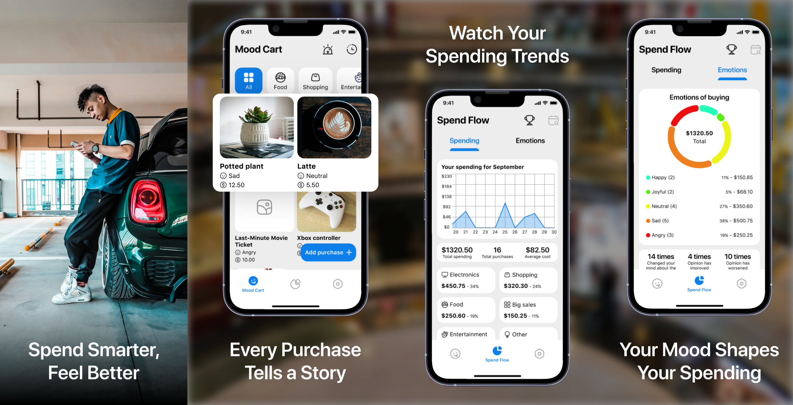
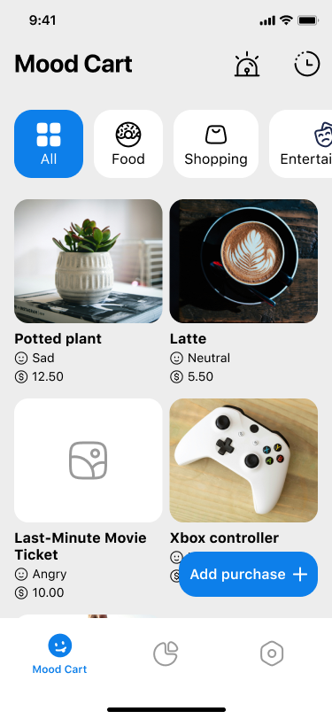
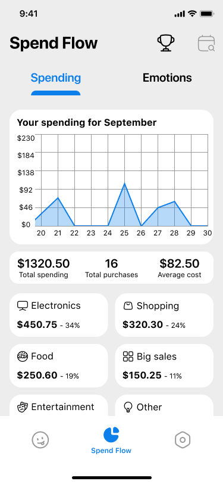

# SpendPulse: Mood Meets Money

**SpendPulse** is a Flutter app that connects your emotions with your spending habits. It helps you track mood fluctuations, visualize daily expenses, set limits, and gain insights into your behavioral and financial patterns.



## 🛠️ Technologies

- **Flutter** and **Dart**
- **Provider** — state management
- **Hive** — local storage
- **Flutter ScreenUtil** — responsive layout
- **Custom charts & visualizations** — pie charts, line graphs, calendar
- **Local assets** — mood icons, illustrations, and resources

## 📱 Screenshots

| Mood Cart | Spend Flow — Emotions | Spend Flow — Spending |
|-----------|------------------------|------------------------|
|  |  |  |

## 🚀 How to Run

1. Clone the repo
   ```sh
   git clone https://github.com/NMMustafina/spendpulse_mood_meets_money.git
   ```
2. Install all the packages by typing the following command
   ```sh
   flutter pub get
   ```
3. Run the App
